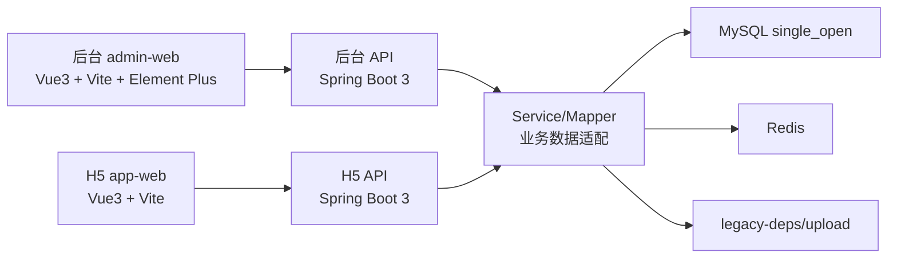

# 《CRMEB Modern》设计说明书

## 1. 设计目标

CRMEB Modern 的设计目标是用现代技术栈提供完整电商系统，同时保留原有业务能力和数据资产。新版项目强调独立交付、可运行、可维护、可渐进扩展。

## 2. 总体架构



## 3. 技术栈

- 后端：Java 17、Spring Boot 3、MyBatis Plus、Maven。
- 后台：Vue 3、Vite、Element Plus、Pinia、Vue Router、Axios。
- H5：Vue 3、Vite、Vue Router、Axios。
- 数据库：MySQL 8，兼容老 `single_open`。
- 缓存：Redis 7。
- 部署：Docker Compose、Nginx。

## 4. 工程结构设计

```text
modern/
├── backend
│   ├── crmeb-modern-common
│   ├── crmeb-modern-service
│   ├── crmeb-modern-admin-api
│   └── crmeb-modern-front-api
├── admin-web
├── app-web
├── deploy
├── docs
├── legacy-deps
├── legacy-source
└── docker-compose.yml
```

## 5. 后端设计

### 5.1 common 模块

提供统一响应、异常处理、通用工具和基础配置。

### 5.2 service 模块

负责实体、Mapper、DTO 和业务服务。该模块适配当前数据库表，保证后台和 H5 共用同一套业务数据。

### 5.3 admin-api 模块

提供后台接口，覆盖登录、商品、订单、用户、营销、装修、财务、设置、应用和维护。

### 5.4 front-api 模块

提供 H5 接口，覆盖首页、分类、商品、购物车、订单、支付、售后、用户中心、营销活动。

## 6. 后台设计

后台采用单页应用设计。菜单和路由保持业务路径稳定，页面使用 Element Plus 组件实现。

主要页面组件：

- 控制台：`DashboardHome.vue`
- 商品：`ProductList.vue`、`ProductBasicEditor.vue`、`ProductCategoryList.vue`
- 订单：`OrderList.vue`、`MobileOrderDetail.vue`
- 用户：`UserList.vue`、`UserGroupList.vue`、`UserGradeList.vue`
- 营销：`CouponList.vue`、`SeckillProductForm.vue`、`CombinationProductForm.vue`、`BargainProductForm.vue`
- 装修：`PageDiyManager.vue`、`PageLayoutManager.vue`
- 应用：`WechatMenuManager.vue`、`WechatReplyForm.vue`、`SmsManager.vue`
- 财务：`FinancialRechargeList.vue`、`FinancialExtractList.vue`、`FinancialMonitorList.vue`

## 7. H5 设计

H5 采用移动端优先设计，兼容主要业务路径，同时优化页面体验。

主要页面：

- 首页/分类：`HomeCategoryView.vue`
- 搜索：`SearchView.vue`
- 商品详情：`ProductDetailPanel.vue`
- 购物车：`CartView.vue`
- 确认订单：`CheckoutView.vue`
- 订单：`OrderListView.vue`、`OrderDetailView.vue`
- 售后：`RefundApplyView.vue`、`RefundListView.vue`
- 支付：`PaymentView.vue`、`PayStatusView.vue`
- 个人中心：`ProfileView.vue`
- 客服：`CustomerServiceView.vue`
- 营销：`SeckillView.vue`、`CombinationView.vue`、`BargainView.vue`

## 8. 数据设计

新版项目不重设计数据库，继续使用 `eb_*` 业务表。业务服务通过显式字段查询和 DTO 输出适配前端。

关键原则：

- 商品、订单、用户、营销、装修数据读写真实业务表。
- 图片字段保留兼容路径。
- SQL 快照随项目交付。
- 不在交付收口阶段新增破坏性迁移。

## 9. 第三方能力设计

微信、支付宝、短信、公众号发布、物流同步等高风险能力采用安全模式：

- 配置页保留。
- 页面入口保留。
- 未配置生产参数时返回安全提示。
- 不在本地演示环境误触发真实外部调用。
